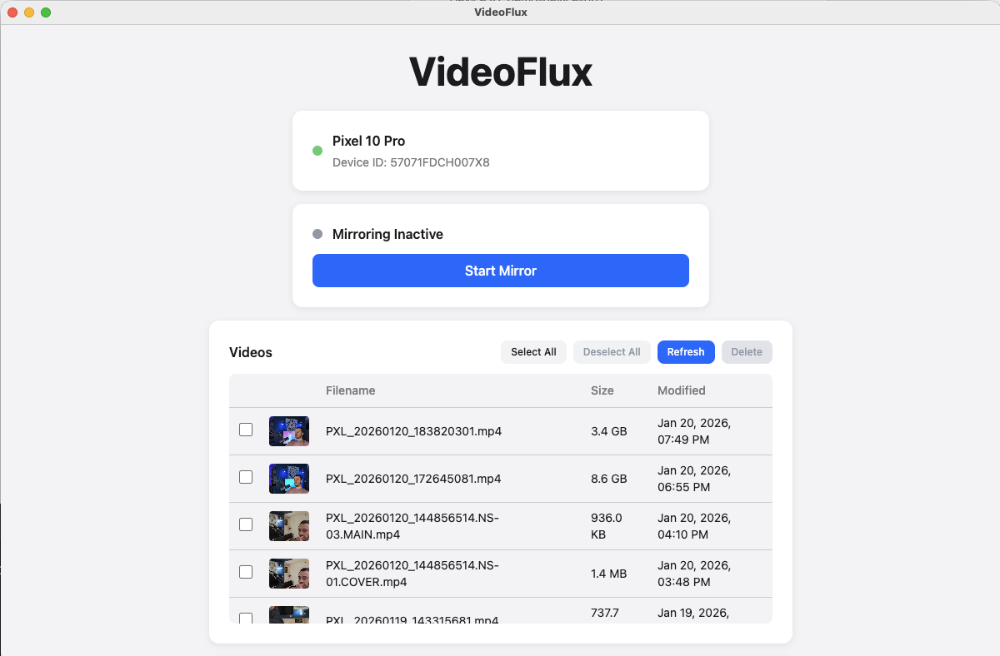
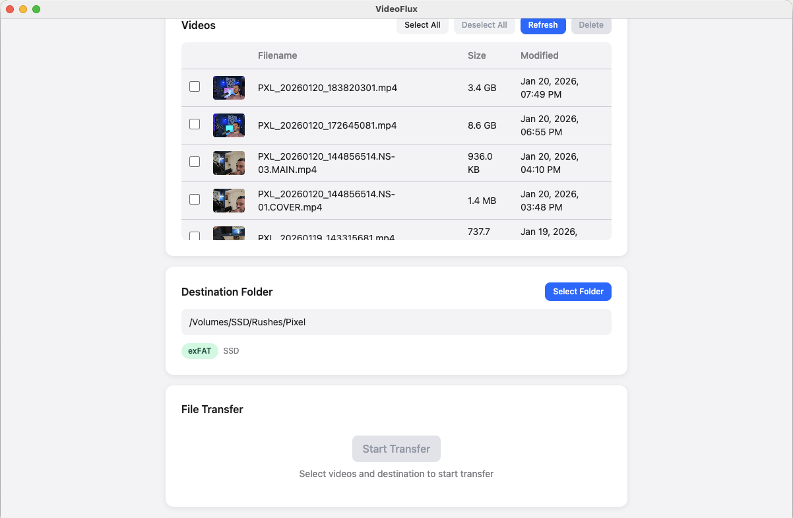

# VideoFlux

> Mirror your Android phone screen and transfer videos to your Mac



## Features

- **Screen Mirroring** - View your Android phone's screen on your Mac in real-time using scrcpy
- **Phone Control** - Control your phone directly from your Mac (tap, swipe, type)
- **Video Transfer** - Browse and transfer videos from your phone with progress tracking
- **Smart Warnings** - Automatic detection of FAT32 file size limits (4GB max)
- **Delete from Phone** - Remove transferred videos from your phone after transfer

## Requirements

- macOS 11.0 (Big Sur) or later
- Android phone with USB debugging enabled
- USB cable (USB-C or Micro USB depending on your phone)

## Installation

### Prerequisites

VideoFlux requires ADB and scrcpy to be installed. Install them via Homebrew:

```bash
brew install android-platform-tools scrcpy
```

### Build from Source

```bash
git clone https://github.com/pancakeInDev/VideoFlux.git
cd VideoFlux
npm install
npm run build
```

The built app will be in the `release/` folder.

## Usage

1. **Enable USB Debugging** on your Android phone:
   - Go to Settings > About Phone
   - Tap "Build Number" 7 times to enable Developer Options
   - Go to Settings > Developer Options
   - Enable "USB Debugging"

2. **Connect your phone** via USB cable

3. **Allow USB Debugging** when prompted on your phone
   - Check "Always allow from this computer"

4. **Launch VideoFlux** - your device should be detected automatically

### Video Transfer



## Architecture

```
VideoFlux/
├── src/
│   ├── main/              # Electron main process
│   │   ├── index.ts       # Entry point, window management
│   │   ├── preload.ts     # IPC bridge (contextBridge)
│   │   ├── adb.ts         # ADB wrapper functions
│   │   ├── scrcpy.ts      # scrcpy process management
│   │   └── filesystem.ts  # File transfer, filesystem detection
│   │
│   ├── renderer/          # React UI (Vite)
│   │   ├── App.tsx        # Main component
│   │   ├── components/    # UI components
│   │   │   ├── DeviceStatus.tsx
│   │   │   ├── MirrorControl.tsx
│   │   │   ├── VideoList.tsx
│   │   │   ├── DestinationPicker.tsx
│   │   │   ├── TransferProgress.tsx
│   │   │   └── LargeFileWarning.tsx
│   │   └── styles/        # Tailwind CSS
│   │
│   └── shared/            # Shared TypeScript types
│       └── types.ts
│
├── tailwind.config.js     # Tailwind configuration
├── vite.config.ts         # Vite bundler config
└── electron-builder.yml   # Electron packaging config
```

### Tech Stack

- **Electron** - Desktop application framework
- **React** - UI library
- **TypeScript** - Type-safe JavaScript
- **Tailwind CSS** - Utility-first CSS framework
- **Vite** - Frontend build tool
- **electron-builder** - App packaging

### IPC Communication

All renderer-to-main process communication uses Electron's `contextBridge` API:

```typescript
// Renderer calls main process via window.videoFlux
window.videoFlux.getDeviceStatus()
window.videoFlux.startMirror()
window.videoFlux.transferFiles(paths, destination)
```

## Development

```bash
# Install dependencies
npm install

# Start development server
npm run dev

# Type checking
npm run typecheck

# Linting
npm run lint

# Build for production
npm run build
```

## Contributing

1. Fork the repository
2. Create a feature branch: `git checkout -b feature/my-feature`
3. Make your changes
4. Run checks: `npm run typecheck && npm run lint`
5. Commit your changes: `git commit -m "feat: add my feature"`
6. Push to your fork: `git push origin feature/my-feature`
7. Open a Pull Request

### Code Style

- TypeScript strict mode enabled
- ESLint for code linting
- Tailwind CSS for styling (no inline styles)
- Conventional commits recommended

## License

MIT License - see [LICENSE](LICENSE) for details.

## Acknowledgments

- [scrcpy](https://github.com/Genymobile/scrcpy) - Screen mirroring tool
- [Android Platform Tools](https://developer.android.com/studio/releases/platform-tools) - ADB
